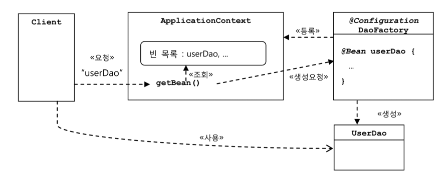
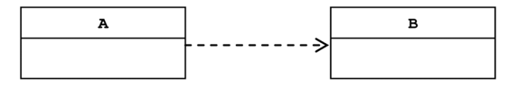

# 오브젝트와 의존관계

<!-- TOC -->
* [오브젝트와 의존관계](#오브젝트와-의존관계)
  * [초난감 DAO](#초난감-dao-)
  * [DAO의 분리](#dao의-분리)
    * [관심사의 분리](#관심사의-분리-)
    * [어떻게 변경을 최소화 하고, 사이드이펙트를 줄일 수있을까?](#어떻게-변경을-최소화-하고-사이드이펙트를-줄일-수있을까)
    * [커넥션 만들기의 추출](#커넥션-만들기의-추출-)
      * [중복 코드의 메소드 추출](#중복-코드의-메소드-추출-)
      * [변경 사항에 대한 검증: 리팩토링과 테스트](#변경-사항에-대한-검증-리팩토링과-테스트-)
    * [DB 커넥션 만들기의 독립](#db-커넥션-만들기의-독립)
      * [상속을 통한 확장](#상속을-통한-확장-)
        * [상속을 통한 확장의 단점](#상속을-통한-확장의-단점)
  * [DAO의 확장](#dao의-확장)
    * [클래스의 분리](#클래스의-분리-)
    * [인터페이스의 도입](#인터페이스의-도입)
    * [관계 설정 책임의 분리](#관계-설정-책임의-분리-)
      * [또 다른 관심사항?](#또-다른-관심사항-)
    * [원칙과 패턴](#원칙과-패턴-)
        * [1. 개방 폐쇄 원칙 (OCP)](#1-개방-폐쇄-원칙-ocp)
        * [2. 높은 응집도와 낮은 결합도](#2-높은-응집도와-낮은-결합도)
        * [3. 전략 패턴](#3-전략-패턴)
  * [제어의 역전(IoC)](#제어의-역전ioc)
    * [오브젝트 팩토리](#오브젝트-팩토리-)
      * [팩토리](#팩토리)
    * [오브젝트 팩토리 활용](#오브젝트-팩토리-활용)
    * [제어권의 이전을 통한 제어관계 역전](#제어권의-이전을-통한-제어관계-역전)
  * [스프링의 IoC](#스프링의-ioc)
    * [오브젝트 팩토리를 이용한 스프링 Ioc](#오브젝트-팩토리를-이용한-스프링-ioc)
        * [애플리케이션 컨텍스트와 설정 정보](#애플리케이션-컨텍스트와-설정-정보)
          * [스프링 빈](#스프링-빈)
          * [빈 팩토리 extends 애플리케이션 컨텍스트](#빈-팩토리-extends-애플리케이션-컨텍스트)
          * [빈 팩토리가 사용하는 설정정보를 만드는 방법](#빈-팩토리가-사용하는-설정정보를-만드는-방법)
      * [DaoFactory를 사용하는 애플리케이션 컨텍스트](#daofactory를-사용하는-애플리케이션-컨텍스트-)
          * [그런데 UserDao를 가져오는 메소드는 하나뿐인데 왜 굳이 이름을 사용할까?](#그런데-userdao를-가져오는-메소드는-하나뿐인데-왜-굳이-이름을-사용할까)
    * [애플리케이션 컨텍스트의 동작 방식](#애플리케이션-컨텍스트의-동작-방식-)
          * [how application context work](#how-application-context-work)
        * [애플리케이션 컨텍스트를 컨텍스트를 사용했을 때 얻을 수 있는 장점](#애플리케이션-컨텍스트를-컨텍스트를-사용했을-때-얻을-수-있는-장점-)
          * [1. 클라이언트는 구체적인 팩토리 클래스를 알 필요가 없다](#1-클라이언트는-구체적인-팩토리-클래스를-알-필요가-없다)
          * [2. 애플리케이션 컨텍스트는 종합 IoC 서비스를 제공해준다](#2-애플리케이션-컨텍스트는-종합-ioc-서비스를-제공해준다)
          * [3. 애플리케이션 컨텍스트는 빈을 검색하는 다양한 방법을 제공한다.](#3-애플리케이션-컨텍스트는-빈을-검색하는-다양한-방법을-제공한다)
    * [스프링 IoC의 용어 정리](#스프링-ioc의-용어-정리-)
        * [빈 (bean)](#빈-bean)
        * [빈 팩토리](#빈-팩토리)
        * [애플리케이션 컨텍스트](#애플리케이션-컨텍스트)
        * [설정정보/설정 메타정보](#설정정보설정-메타정보-)
        * [컨테이너 또는 IoC 컨테이너](#컨테이너-또는-ioc-컨테이너)
        * [스프링 프레임워크](#스프링-프레임워크)
  * [싱글톤 레지스트리와 오브젝트 스코프](#싱글톤-레지스트리와-오브젝트-스코프-)
    * [싱글톤 레지스트리로서의 애플리케이션 컨텍스트](#싱글톤-레지스트리로서의-애플리케이션-컨텍스트)
      * [서버 애플리케이션과 싱글톤](#서버-애플리케이션과-싱글톤)
      * [싱글톤 패턴의 한계](#싱글톤-패턴의-한계)
          * [private 생성자를 가지고 있기 때문에 상속할 수 없다](#private-생성자를-가지고-있기-때문에-상속할-수-없다)
          * [싱글톤은 테스트하기 힘들다](#싱글톤은-테스트하기-힘들다-)
          * [서버환경에서는 싱글톤이 하나만 만들어지는 것을 보장하지 못한다](#서버환경에서는-싱글톤이-하나만-만들어지는-것을-보장하지-못한다)
          * [싱글톤의 사용은 전역 상태를 만들 수 있기 때문에 바람직하지 못하다](#싱글톤의-사용은-전역-상태를-만들-수-있기-때문에-바람직하지-못하다)
      * [싱글톤 레지스트리](#싱글톤-레지스트리)
        * [싱글톤 레지스트리 장점](#싱글톤-레지스트리-장점)
    * [싱글톤과 오브젝트 상태](#싱글톤과-오브젝트-상태-)
        * [상태가 없는 방식으로 클래스를 만드는 경우에 각 요청에 대한 정보나, DB나 서버의 리소스로 부터 생성한 정보는 어떻게 다뤄야 할까?](#상태가-없는-방식으로-클래스를-만드는-경우에-각-요청에-대한-정보나-db나-서버의-리소스로-부터-생성한-정보는-어떻게-다뤄야-할까-)
    * [스프링 빈의 스코프](#스프링-빈의-스코프-)
  * [의존관계 주입(DI)](#의존관계-주입di)
    * [제어의 역전(IoC)과 의존관계 주입](#제어의-역전ioc과-의존관계-주입)
    * [런타임 의존관계 설정](#런타임-의존관계-설정)
      * [의존관계](#의존관계)
      * [UserDao의 의존관계](#userdao의-의존관계)
      * [UserDao의 의존관계 주입](#userdao의-의존관계-주입)
    * [의존관계 검색과 주입](#의존관계-검색과-주입)
    * [의존관계 주입의 응용](#의존관계-주입의-응용)
      * [기능 구현의 교환](#기능-구현의-교환)
      * [부가 기능 추가](#부가-기능-추가-)
    * [메소드를 이용한 의존관계 주입](#메소드를-이용한-의존관계-주입)
      * [수정자 메소드를 이용한 주입](#수정자-메소드를-이용한-주입-)
      * [일반 메소드를 이용한 주입](#일반-메소드를-이용한-주입)
  * [XML을 이용한 설정](#xml을-이용한-설정-)
* [정리](#정리)
<!-- TOC -->

- 스프링은 자바에서 가장 중요하게 가치를 두는 것은 바로 
  - **객체지향 프로그래밍**이 가능한 언어라는 점
- 그래서 스프링이 가장 관심을 많이 두는 대상은 **오브젝트**

- 스프링은 객체 지향 설계와 구현에 관해 특정한 모델과 기법을 억지로 강요하지 않는다X.
  - 하지만 **오브젝트를 어떻게 효과적으로 설계하고 구현하고, 사용하고 이를 개선해 나갈 것인가에 대한 명쾌한 기준을 마련해줌**
  - 동시에 스프링은 객체지향 기술과 설계, 구현에 관한 실용적인 전략과 베스트 프랙티스를 평범한 개발자도 자연스럽고 손 쉽게 적용할 수 있도록 프레임워크 형태로 제공

## 초난감 DAO 

- 사용자 정보를 JDBC API를 통해 DB 에 저장하고 조회 할 수 있는 간단한 DAO 만들어보자

```java
public class UserDao {

  public void add(User user) throws ClassNotFoundException, SQLException {
    Class.forName("com.mysql.cj.jdbc.Driver");
    Connection c = DriverManager.getConnection(
        "jdbc:mysql://localhost/test", "root", "qkrwodhks1!"
    );

    PreparedStatement ps = c.prepareStatement(
        "insert into users(id, name, password) values(?,?,?)"
    );
    ps.setString(1, user.getId());
    ps.setString(2, user.getName());
    ps.setString(3, user.getPassword());

    ps.executeUpdate();

    ps.close();
    c.close();
  }

  public User get(String id) throws ClassNotFoundException, SQLException {
    Class.forName("com.mysql.cj.jdbc.Driver");
    Connection c = DriverManager.getConnection(
        "jdbc:mysql://localhost/test", "root", "qkrwodhks1!"
    );

    PreparedStatement ps = c.prepareStatement(
        "select * from users where id = ?"
    );
    ps.setString(1, id);

    ResultSet rs = ps.executeQuery();
    rs.next();
    User user = new User();
    user.setId(rs.getString("id"));
    user.setName(rs.getString("name"));
    user.setPassword(rs.getString("password"));

    rs.close();
    ps.close();
    c.close();

    return user;
  }

  public static void main(String[] args) throws SQLException, ClassNotFoundException {
    UserDao dao = new UserDao();

    User user = new User();
    user.setId("wan2daaa");
    user.setName("박재완");
    user.setPassword("1234");

    dao.add(user);

    System.out.println(user.getId() + "등록 성공");

    User user2 = dao.get(user.getId());
    System.out.println(user2.getName());
    System.out.println("user2.getPassword() = " + user2.getPassword());

    System.out.println("user2.getId() = " + user2.getId() + " 조회 성공");
  }

}
```

## DAO의 분리

### 관심사의 분리 

- 객체지향의 세계에서는 모든 것이 변한다. 
  - 여기서 변한다는 것은 변수나 오브젝트 필드의 값이 변한다는 게 아니다
- **오브젝트에 대한 설계와 이를 구현한 코드가 변한다는 뜻**

- 개발자가 객체를 설계할 때 가장 염두에 둬야할 사항은 바로 **미래의 변화를 어떻게 대비할 것인가이다**.
- 객체지향 설계와 프로구래밍이 이전의 절차적 프로그래밍 패러다임에 비해 초기에 좀 더 많은, 번거로운 작업을 요구하는 이유는
  - 객체지향 기술 자체가 지니는, 변화에 효과적으로 대처할 수있다는 기술적인 특징 때문이다.
  - 객체지향 기술이 만들어내는 가상의 추상세계 자체를 효과적으로 구성할 수 있고,
    - 이를 자유롭고 편리하게 변경, 발전, 확장시킬 수 있다는 데 더 의미가 있다.

> **변경이 일어날 때 필요한 작업을 최소화, 그 변경이 다른 곳에 문제를 일으키지 않게 하는것이 중요**

### 어떻게 변경을 최소화 하고, 사이드이펙트를 줄일 수있을까?

> **분리와 확장**을 고려한 설계

- 먼저 분리에 대해 생각해보자 

- 모든 변경과 발전은 한번에 한가지 관심사항에 집중해서 일어난다
  - 문제는, 변화는 대체로 집중된 한 가지 관심에 대해 일어나지만, 
  - 그에따른 작업은 한 곳에 집중되지 않는 경우가 많다는 점

- e.x. 단지 DB 접속용 암호를 변경하려고 DAO 클래스 수백 개를 모두 수정해야 한다면? 

- 변화가 한 번에 한 가지 관심에 집중돼서 일어난다면,
  - 우리가 준비해야 할 일은 **한가지 관심이 한 군데에 집중되게 하는 것**이다.
- **즉, 관심이 같은 것끼리는 모으고, 관심이 다른 것은 따로 떨어져 있게 하는 것이다.**

### 커넥션 만들기의 추출 

- UserDao의 구현된 메소드를 다시 살펴보면,
- add() 메소드 하나에서만 적어도 세 가지 관심사항을 발견할 수 있다.

```java
  public void add(User user) throws ClassNotFoundException, SQLException {
    Class.forName("com.mysql.cj.jdbc.Driver");
    Connection c = DriverManager.getConnection(
        "jdbc:mysql://localhost/test", "root", "qkrwodhks1!"
    );

    PreparedStatement ps = c.prepareStatement(
        "insert into users(id, name, password) values(?,?,?)"
    );
    ps.setString(1, user.getId());
    ps.setString(2, user.getName());
    ps.setString(3, user.getPassword());

    ps.executeUpdate();

    ps.close();
    c.close();
  }
```

1. DB와 연결을 위한 커넥션을 어떻게 가져올까라는 관심 
- 어떤 DB를 쓰고
- 어떤 드라이버를 사용할 것이고
- 어떤 로그인 정보를 쓰는데
- 그 커넥션을 생성하는 방법은 또 어떤것이다 
- 세부관심까지 분류하면 너무 복잡해지므로
- 일단은 뭉뚱그려서 DB 연결과 관련된 관심이 하나라고 보자 

2. 사용자 등록을 위해 DB에 보낼 SQL 문장을 담을 `Statement`를 만들고 실행하는 것이다.
- 파라미터로 넘어온 사용자 정보를 `Statement`에 바인딩 시키고, 
- `Statement`에 담긴 SQL을 DB를 통해 실행시키는 방법이다.
- 파라미터를 바인딩하는 것과 
- 어떤 SQL을 사용할지를 다른 관심사로 분리 가능하지만
- 우선은 이것도 하나로 묶어서 생각하자 

3. 작업이 끝나면 사용한 리소스인 `Statement`와 `Connection` 오브젝트를 닫아줘서 소중한 공유 리소스를 시스템에 돌려주는 것

- 가장 문제가 되는 것은 첫 번째 관심사인 DB 연결을 위한 `Connection`오브젝트를 가져오는 부분
- 현재 DB 커넥션을 가져오는 코드는 다른 관심사와 섞여서 같은 `add()`메소드에 담겨 있다.
- 더 큰 문제는 `add()`메소드에 있는 DB 커넥션을 가져오는 코드와 동일한 코드가 `get()` 메소드에도 중복되어 있다는 점

- 지금은 동일한 코드가 2개의 메소드에 중복이지만, 수백, 수천개의 DAO 메소드를 만들게 되면 **중복이 계속 나타날 것**

- 이렇게 하나의 관심사가 방만하게 중복되어 있고, 여기저기 흩어져 있어서 다른 관심의 대상과 얽혀 있으면, 
- 변경이 일어날 때 엄청난 고통을 일으키는 원인이 된다.

#### 중복 코드의 메소드 추출 

- 커넥션을 가져오는 중복된 코드를 분리하는 것 
- 중복된 DB 연결 코드를 `getConnection()`이라는 이름의 독립적인 메소드로 만들어주자 

- 관심의 종류에 따라 앞으로는 `getConnection()`이라는 한 메소드의 코드만 수정하면 된다.
- 관심이 다른 코드가 있는 메소드에는 영향을 주지도 않을뿐더러, 관심 내용이 독립적으로 존재하므로 수정도 간단

#### 변경 사항에 대한 검증: 리팩토링과 테스트 

- 위에서 한 작업을 **리팩토링**이라 한다.
- 또한 위에서 사용한 `getConnection()` 이라고 하는 공통의 기능을 담당하는 메소드로 중복된 코드를 뽑아내는 것을 
  - 리팩토링에서는 **메소드 추출**기법이라고 한다 

> 리팩토링
>> 기존의 코드를 외부의 동작방식에는 변화없이 내부 구조를 변경해서 재구성하는 작업또는 기술을 말한다.
>> 리팩토링을 하면 코드 내부의 설계가 개선되어 코드를 이해하기가 더 편해지고,
>> 변화에 효율적으로 대응할 수 있다. 결국 생산성은 올라가고, 코드의 품질은 높아지며, 
>> 유지보수하기 용이해지고, 견고하면서도 유연한 제품을 개발할 수이싿. 


### DB 커넥션 만들기의 독립

- 메소드 추출만으로도 변화에 좀더 유연하게 대처할 수있는 코드를 만들었다. 
- 이번엔 좀더 나아가서 변화에 대응하는 수준이 아니라, 아예 변화를 반기는 DAO를 만들어보자 

- e.x. 우리가 만든 DAO를 여러 다른 회사에서 사용할려고하고, 각기 다른 DB를 사용하고 있고, DB커넥션을 각각의 방법으로 적용하고 싶어한다. 
- DAO를 구매한 이후에도 DB 커넥션을 가져오느 방법이 종종 변경될 가능성이 있다는 점이다.

#### 상속을 통한 확장 

- 일단 우리가 만든 UserDao에서 메소드의 구현 코드를 제거하고 getConnection()을 추상 메소드로 만들어 놓는다. 
- 추상 메소드라서 메소드 코드는 없지만 메소드 자체는 존재
- 따라서 add(), get() 메소드에서 `getConnection()`을 호출하는 코드는 그대로 유지
- 이 추상클래스인 UserDao 를 판매

```java
public abstract class UserDao_3 {

  public void add(User user) throws ClassNotFoundException, SQLException {
    return user;
  }

  public void deleteAll() throws ClassNotFoundException, SQLException {
  }

  /**
   * 구현 코드는 제거되고 추상 메소드로 바뀌었다.
   * 메소드의 구현은 서브클래스가 담당한다.
   */
  public abstract Connection getConnection() throws ClassNotFoundException, SQLException;

  public class NUserDao extends UserDao_3 {
    public Connection getConnection() throws ClassNotFoundException, SQLException {
      return null;      
    }
  }

  public class DUserDao extends UserDao_3 {
    public Connection getConnection() throws ClassNotFoundException, SQLException {
      return null;
    }
  }
}

```

- DAO의 핵심 기능인 어떻게 데이터를 등록하고 가져올 것인가 라는 관심을 담당하는 UserDao와,
- DB 연결 방법은 어떻게 할 것인가라는 관심을 담고있는 NUserDao, DUserDAo가 클래스 레벨로 구분이 되고 있다

- 이제는 UserDao의 코드는 한 줄도 수정할 필요 없이 DB 연결기능을 새롭게 정의한 클래스를 만들 수 있다.
  - 손쉽게 확장된다라고 말할 수도 있게 됐다 

- 이렇게 슈퍼클래스에 기본적인 로직의 흐름을 만들고, 그 기능의 일부를 추상 메소드나 오버라이딩이 가능한 protected 메소드 등으로 만든 뒤 
- -> 서브 클래스에서 이런 메소드를 필요에 맞게 구현해서 사용하도록 하는 방법을 
  - 디자인 패턴에서 `템플릿 메소드 패턴` 이라고 한다.

- UserDao의 `getConnection()` 메소드는 `Connection`타입 오브젝트를 생성한다는 기능을 정의해 놓은 추상 메소드다.
  - 그리고 UserDao의 서브클래스의 `getConnection()` 메소드는 
    - **어떤 `Connection` 클래스의 오브젝트를 어떻게 생성할 것인지를 결정하는 방법이라고 볼 수 있다**.
  - **이렇게 서브클래스에서 구체적인 오브젝트 생성방법을 결정하게 하는 것을**
    - == `팩토리 메서드 패턴` 이라고 부르기도 한다.

- 템플릿 메소드 패턴 또는 팩토리 메소드 패턴으로 관심사항이 다른 코드를 분리해 내고,
- 서로 독립적으로 변경 또는 확장할 수 있도록 만드는 것은
- 매우 효과적인 방법

- **하지만 상속을 사용했다는 단점이있다.**
##### 상속을 통한 확장의 단점

1. 만약 이미 UserDao가 다른 목적을 위해 상속을 사용하고 있다면 후에 다른 목적으로 UserDao에 상속을 적용하기 힘들다
2. 상속을 통한 상하위 클래스의 관계는 생각보다 밀접하다
   - 여전히 상속 관계는 두 가지 다른 관심사에 대해 긴밀한 결합을 허용한다.
   - 서브클래스는 슈퍼클래스의 기능을 직접 사용할 수있다.
     - 그래서 슈퍼클래스 내부의 변경이 있을 때 모든 서브 클래스를 함께 수정하거나 다시 개발해야할 수도 있다

3. 확장된 기능인 DB 커넥션을 생성하는 코드를 다른 DAO 클래스에 적용할 수 없다는 것도 큰 단점이다
   - 만약 UserDao 외의 DAO 클래스들이 계속 만들어진다면,
   - 그때는 상속을 통해서 만들어진 `getConnection()` 구현코드가 매 DAO 클래스마다 중복되서 나타나는 심각한 문제가 생길 것이다.


## DAO의 확장

- 모든 오브젝트는 변한다.
- 그렇지만, 오브젝트다 다 동일한 방식으로 변하는건 아니다

- 변화의 성격이 다르다는 건 **변화의 이유와 시기, 주기 등이 다르다는 뜻이다.**

e.x.
<br/>
UserDao 는
<br/>
1. JDBC API를 사용할 것인가 DB 전용 API를 사용할 것인가, 
2. 어떤 테이블 이름과 필드 이름을 사용해 어떤 SQL을 만들 것인가 
3. 어떤 오브젝트를 통해 DB에 저장할 정보를 전달받고,
4. DB에서 꺼내온 정보를 저장해서 넘겨줄 것인가 
<br/>
와 같은 관심을 가진 코드들을 모아놓은 것

---
<br/>

- 따라서 이런 관심사가 바뀌면 그때 변경이 일어난다

- 추상 클래스를 만들고 이를 상속한 서브클래스에서 변화가 필요한 부분을 바꿔서 쓸 수 있게 만든 이유는
  - 바로 이렇게 **변화의 성격이 다른 것을 분리해서**, 
  - **서로 영향을 주지 않은 채로** 
  - **각각 필요한 시점에 독립적으로 변경할수 있게** 하기 위해서다.    

> 그러나 여러가지 단점이 많은, 상속이라는 방법을 사용했다는 사실이 불편하게 느껴진다


### 클래스의 분리 

- 이번에는 아예 상속관계도 아닌 완전히 독립적인 클래스로 만들어 보겠다.
- DB 커넥션과 관련된 부분을 서브클래스가 아니라, 아예 별도의 클래스에 담는다
- 그리고 이렇게 만든 클래스를 UserDao가 이용하게 하면된다.

```java
public class UserDao_4 {
  private SimpleConnectionMaker simpleConnectionMaker;

  public UserDao_4() {
    // 상태를 관리하는 것도 아니니 한 번만 만들어 인스턴스 변수에 저장해두고 메소드에서 사용하게 한다.
    simpleConnectionMaker = new SimpleConnectionMaker();
  }

  public void add(User user) throws ClassNotFoundException, SQLException {
    Connection c = simpleConnectionMaker.makeNewConnection();
    //...
  }

  public User get(String id) throws ClassNotFoundException, SQLException {
    Connection c = simpleConnectionMaker.makeNewConnection();
  //...
    return user;
  }

  public void deleteAll() throws ClassNotFoundException, SQLException {
    Connection c = simpleConnectionMaker.makeNewConnection();
  //...
  }
}
public class SimpleConnectionMaker {
  public Connection makeNewConnection() throws ClassNotFoundException, SQLException {
    Class.forName("com.mysql.cj.jdbc.Driver");
    Connection c = DriverManager.getConnection(
            "jdbc:mysql://localhost/test", "root", "qkrwodhks1!"
    );
    return c;
  }
}
```
- 다음 간단하게 리팩토링이 제대로 됐는지 main 으로 정상 작동 확인!


하지만 다른 문제가 생겼다 
- 전의 상속으로 만든 서브 클래스에 UserDao 클래스만 공급하고 상속을 통해 DB 커넥션 기능을 확장해서 사용했던게 다시 불가능 해졌다.
  - 왜냐하면 UserDao 코드가 `SimpleConnectionMaker`라는 특정 클래스에 종속되어 있기 때문에 상속을 사용했을 때 처럼 
  - **UserDao 코드의 수정없이 DB 커넥션 생성기능을 변경할 방법이 없기 때문**


- 이렇게 클래스를 분리한 경우에도 상속을 이용했을 때와 마찬가지로 자유로운 확장이 가능하게 하려면 두가지 문제를 해결해야함 
1. `SimpleConnectionMaker`의 메소드의 문제
   - 우리는 makeNewConnection()을 사용해 가져오게 만들었는데, 만약 D사에서 만든 DB 커넥션 제공 클래스는 openConnection() 이름을 사용했다면,
     - add(), get() 메소드의 커넥션 부분 코드를 일일이 변경해야한다.


2. DB 커넥션을 제공하는 클래스가 어떤 것인지를 UserDao가 구체적으로 알고 있어야 한다는 점
  - UserDao에 `SimpleConnectionMaker`라는 **클래스 타입의** 인스턴스 변수까지 정의해 놓고 있으니 서브 클래스에서 다른 클래스를 구현하려면 UserDao를 수정해야함


- 이런 문제의 근본적인 원인은 UserDao가 바뀔 수 있는 정보, 즉 DB 커넥션을 가져오는 클래스에 대해 너무 많이 알고 있기 때문!
- 지금은 UserDao 클래스가 `SimpleConnectionMaker`라는 특정 클래스와 그 코드에 종속적이기 때문에 자유롭게 확장하기 어려워 졌다.

### 인터페이스의 도입
- **클래스를 분리하면서도** 이런 문제를 해결할 수 없을까? 

>가장 좋은 해결책은 두개의 클래스가 서로 긴밀하게 연결 되어 있지 않도록 **중간에 추상적인 느슨한 연결고리를 만들어 주는 것**

- 추상화란
  - 어떤 것들의 공통적인 성격을 뽑아내어 이를 따로 분리해내는 작업
  - 자바가 추상화를 위해 제공하는 도구는 **인터페이스**이다.


- 인터페이스
  - 자신을 구현한 클래스에 대한 구체적인 정보는 모두 감춰버린다
  - 결국 오브젝트를 만들려면 구체적인 클래스 하나를 선택해야 겠지만, 
  - 인터페이스로 추상화해놓은 최소한의 통로를 통해 **접근하는 쪽에서는 오브젝트를 만들 때 사용할 클래스가 무엇인지 몰라도 된다**.
  - 인터페이스는 어떤 일을 하겠다는 기능만 정의해 놓은 것
    - **어떻게 하겠다는 구현 방법은 나타나지 않아있다**
    - **인터페이스를 구현한 클래스들이 알아서 결정할 일이다!**

```java
public interface ConnectionMaker {
  public Connection makeConnection() throws ClassNotFoundException, SQLException;
}

public class CustomConnectionMaker implements ConnectionMaker{
  @Override
  public Connection makeConnection() throws ClassNotFoundException, SQLException {
    Class.forName("com.mysql.cj.jdbc.Driver");
    Connection c = DriverManager.getConnection(
            "jdbc:mysql://localhost/test", "root", "qkrwodhks1!"
    );
    return c;
  }
}

public class UserDao_5 {
  private ConnectionMaker connectionMaker; // 구체적인 클래스 정보를 알 필요가 없다!

  public UserDao_5() {
    connectionMaker = new CustomConnectionMaker(); // *** 하지만 여기 클래스 이름이 나온다!!!!! ***
  }

  public void add(User user) throws ClassNotFoundException, SQLException {
    Connection c = connectionMaker.makeConnection(); // 인터페이스에 정의된 메소드를 사용해서 클래스가 바껴도 걱정 없다.
    // ...
  }

  public User get(String id) throws ClassNotFoundException, SQLException {
    Connection c = connectionMaker.makeConnection();
  // ...
  }
```
- 이전 처럼 UserDao 코드를 뜯어 고칠 일은 없어보인다
- 하지만 CustomConnectionMaker 라는 클래스 이름이 보인다
- 여전히 클래스가 남아있다


- UserDao의 다른 모든 곳에서는 인터페이스를 이용하게 해서 DB 커넥션을 제공하는 클래스에 대한 구체적인 정보는 모두 제거 가능했지만, 
- 초기에 한번 어떤 클래스의 오브젝트르 사용할지를 결정하는 생성자의 코드에는 제거되지 않고 남아있다.
- 다른 Dao가 생기면 또 전부다 교체 해야하니,
- 이렇게 해서는 자유로운 DB 커넥션 확장 기능을 가진 UserDao를 만들 수없다. 


### 관계 설정 책임의 분리 
- 여전히 UserDao에는 어떤 ConnectionMaker 구현 클래스를 사용할지를 결정하는 코드가 남아있다.
  - 이때문에 인터페이스를 이용한 분리에도 불구하고 여전히 UserDao 변경없이 Db 커넥션 기능의 확장이 자유롭지 못하다 
    - **그 이유는 UserDao 안에 분리되지 않은, 또 다른 관심사항이 있기 때문이다.**

#### 또 다른 관심사항? 
- UserDao에는 어떤 ConnectionMaker 구현 클래스를 사용할지를 결정하는 new DConnectionMaker() 라는 코드가 있다
- 이 코드는 매우 짧고 간결하지만, 
  - **UserDao가 어떤 ConnectionMaker 구현 클래스의 오브젝트를 이용하게 할지를 결정하는 것**
  - 간단하게 말하면, UserDao와 UserDao가 사용할 ConnectionMaker의 특정 구현 클래스 사이의 관계를 설정해주는 것에 관한 관심이다.


결국 이 부분을 분리하지 않으면 Userdao는 결코 독립적으로 확장 가능한 클래스가 될 수없다.

> UserDao 와 ConnectionMaker 구현 클래스의 관계를 결정해주는 기능을 분리해서 두기 적절한 곳은 
>> 바로 UserDao의 클라이언트 오브젝트 (UserDao를 사용할 클래스) 이다 

- 클래스가 아니라 오브젝트와 오브젝트 사이의 관계를 설정해줘야한다.
- 오브젝트 사이의 관계가 만들어지려면 일단 만들어진 오브젝트가 있어야 하는데,
- 이처럼 직접 생성자를 호출해서 직접 오브젝트를 만드는 방법도 있지만,
- 외부에서 만들어준 것을 가져오는 방법도 있다.

- 외부에서 만든 오브젝트를 전달받으려면 메소드 파라미터나 생성자 파라미터를 이용하면됨 

- 여기서 중요한 것은
  - 클래스사이에 관계가 만들어지는게 아니라
    - 코드에 다른 클래스 이름이 나타나기 때문에 만들어지는 것
  - 단지, 오브젝트 사이에 다이내믹한 관계가 만들어지는 것이다.
    - 코드에서는 특정 클래스를 전혀 알지 못하더라도 해당 클래스가 구현한 인터페이스를 사용했다면,
      - 그 클래스의 오브젝트를 인터페이스 타입으로 받아서 사용할 수 있다.
    - 바로 객체지향 프로그램에는 **다형성**이라는 특징이 있는 덕분!

```java
  private ConnectionMaker connectionMaker;

public UserDao_6(ConnectionMaker connectionMaker) {
  this.connectionMaker = connectionMaker; //생성자 주입 
}

public class UserDaoTest {
  public static void main(String[] args) {

    //UserDao 가 사용할 ConnectionMaker 구현 클래스를 결정하고 오브젝트를 만든다.
    ConnectionMaker connectionMaker = new CustomConnectionMaker();
    
    UserDao_6 dao = new UserDao_6(connectionMaker);
  }
}

```

- UserDaoTest는 UserDao 와 ConnectionMaker 구현 클래스와의 런타임 오브젝트 의존관계를 설정하는 책임을 담당
- 이렇게 DB 연결 기능을 확장해서 사용가능 !

```java
public class UserDaoTest {
  public static void main(String[] args) {

    //UserDao 가 사용할 ConnectionMaker 구현 클래스를 결정하고 오브젝트를 만든다.
    ConnectionMaker connectionMaker = new CustomConnectionMaker();
    ConnectionMaker dconnectionMaker = new DConnectionMaker();

    UserDao_6 dao = new UserDao_6(connectionMaker);
    UserDao_6 dao2 = new UserDao_6(dconnectionMaker);
  }
}
```

> 인터페이스를 도입하고 **클라이언트의 도움을 얻는 방법**은 
> 상속을 사용해 비슷한 시도를 했을 경우에 비해서 **훨씬 유연**하다.


### 원칙과 패턴 
- 지금 까지 수정한 DAO 코드를 개선해온 결과를 객체지향 기술의 여러가지 이론을 통해 설명

##### 1. 개방 폐쇄 원칙 (OCP)

>클래스나 모듈은 확장에는 열려 있어야하고 변경에는 닫혀있어야한다. 


- UserDao는 DB 연결 방법이라는 기능을 확장하는데는 열려있다.
- 동시에 UserDao 자신의 핵심 기능을 구현한 코드는 그런 변화에 영향을 받지 않고 유지할 수있으므로 변경에는 닫혀있다고 말할 수 있다.

- DB 커넥션 같은 확장 포인트는 활장을 위해 개방되어있고
- 인터페이스를 이용하는 클래스는 자신의 변화를 불필요하게 일어나지 않도록 굳게 닫혀있다.

##### 2. 높은 응집도와 낮은 결합도
-  응집도가 높다는건 
  - 하나의 모듈, 클래스가 하나의 책임 또는 관심사에만 집중되어 있다는 뜻 
  - 불필요하거나 직접 관련이 없는 외부의 관심과 책임이 얽혀 있지 않으며, 하나의 공통 관심사는 하나의 클래스에 모여있다.
  - ConnectionMaker로 따로 분리해서 그 부분만 수정하면 되는 부분

- 낮은 결합도 
  - 책임과 관심사가 다른 오브젝트 또는 모듈과는 낮은 결합도, 즉 느슨하게 연결된 형태를 유지하는 것이 바람직 
  - 관계를 유지하는데 꼭 필요한 최소한의 방법만 간접적인 형태로 제공하고, 나머지는 서로 독립적이고 알 필요도 없게 만들어 주는 것 
  - **ConnectionMaker 와 UserDao의 결합도가 낮아 진 부분** 

##### 3. 전략 패턴
- OCP 실현에도 가장 잘 들어 맞는 패턴

> 자신의 기능 맥락에서, 필요에 따라 변경이 필요한 알고리즘을 인터페이스를 통해 통째로 외부로 분리시키고,
> 이를 구현한 구체적인 알고리즘 클래스를 필요에 따라 바꿔서 사용할 수 있게하는 디자인 패턴이다.

- 즉 DB 연결이라는 알고리즘을 ConnectionMaker 라는 인터페이스로 정의하고, 이를 구현한 클래스, 즉 전략을 바꿔가면서 사용할 수있게 분리

## 제어의 역전(IoC)

### 오브젝트 팩토리 
- UserDaoTest는 제대로 처리하지 않았다
- UserDaoTest는 어떤 ConnectionMaker 구현 클래스를 사용할지 결정하는 기능을 떠맡았다
- 그런데 원래 UserDaoTest는 UserDao의 기능이 잘 동작하는지를 테스트 하려고 만든 것인데 
- 지금은 다른 책임까지 떠맡고 있으니 뭔가 문제가 있다.


- 그러니 이것도 분리하자.

#### 팩토리
- 분리 시킬 기능을 담당할 클래스를 하나 만들어보자
- 이 클래스의 역할은 **객체의 생성 방법을 결정**하고 **그렇게 만들어진 오브젝트를 돌려주는 것**인데
  - 이런 일을 하는 오브젝트를 흔히 **팩토리** 라고한다.

> 추상 팩토리 패턴이나 팩토리 메서드 패턴과든 다르다

```java
import 토비의스프링vol1.chap_1_오브젝트와_의존관계.dao_seperate.with_interface.without_class.UserDao_6;

public class DaoFactory {

  public UserDao_6 userDao() {
    ConnectionMaker connectionMaker = new CustomConnectionMaker();
    UserDao_6 userDao = new UserDao_6(connectionMaker);
    return userDao;
  }
}

public class UserDaoTest {

  public static void main(String[] args) {
    UserDao_6 dao = new DaoFactory().userDao();
  }
}
```

### 오브젝트 팩토리 활용

- e.x. DaoFactory에 UserDao가 아닌 다른 DAO의 생성 기능을 넣으면 어떻게 될까?
- AccountDao, MessageDao 등을 만들었다고 생각해보자
  - 위 DAO 들이 모두 `new CustomConnectionMaker` 를 사용하면 
  - 오브젝트를 생성하는 코드가 메소드마다 반복될 것이다.
    - 이렇게 오브젝트 생성 코드가 중복되는건 좋지 않은 현상이다.


- 중복을 해결하려면 역시 분리해 내는게 좋은 방법
  - ConnectionMaker의 구현 클래스를 결정하고 오브젝트를 만드는 코드를 별도의 메소드로 뽑아내자 

```java
public class DaoFactory {
  public UserDao_6 userDao6 () {
    return new UserDao_6(connectionMaker());
  }
  public AccountDao accountDao() {
    return new AccountDao(connectionMaker());
  }
  public MessageDao messageDao() {
    return new MessageDao(connectionMaker());
  }
  
  public ConnectionMaker connectionMaker() {
    return new CustomConnectionMaker(); // 분리해서 중복을 제거한 ConnectionMaker 타입 오브젝트 생성코드
  }
}
```

### 제어권의 이전을 통한 제어관계 역전
- 제어의 역전이라는건 간단히 프로그램의 제어 흐름 구조가 뒤바뀌는 것이라고 설명할 수있다

- 오브젝트가 자신이 사용할 오브젝트를 스스로 선택하지 않는다.
- 당연히 생성하지도 않는다.
- 모든 제어권한을 자신이 아닌 다른 대상에게 위임하기 때문

<br/>

- 예전 서브 클래스에서는 getConnection()을 구현하지만, 언제 어떻게 사용될지 모른다.
- 제어권을 상위 템플릿 메소드에 넘기고 자신은 필요할때 호출되어 사용되도록 한다는, 제어의 역전 개념을 볼 수있다.

<br/>

- 프레임워크도 제어의 역전 개념이 적용된 대표적인 기술이다

- 라이브러리를 사용하는 애플리케이션 코드는 애플리케이션 흐름을 직접 제어한다.
  - 반면에 프레임워크는 거꾸로 애플리케이션 코드가 프레임워크에 의해 사용 된다.

- 우리가 만든 UserDao와 DaoFactory에도 제어의 역전이 적용되어 있다.
- 원래 ConnectionMaker의 구현 클래스 결정권은 UserDao에 있었다
  - 그런데 지금은 DaoFactory에 있다.
  - 이제 UserDao는 능동적이아니라 수동적인 존재가 되었다.
- 자연스럽게 관심을 분리하고 책임을 나누고 유연하게 확장 가능한 구조로 만들기 위해 DaoFactory를 도입한 과정이 바로 Ioc를 적용하는 작업

## 스프링의 IoC

- 스프링의 핵심을 담당하는 건, 바로 빈 팩토리 또는 애플리케이션 컨텍스트라고 불리는 것
- 이 두가지는 우리가 만든 DaoFactory가 하는 일을 좀더 일반화 한 것이라고 설명할 수있다.

### 오브젝트 팩토리를 이용한 스프링 Ioc

##### 애플리케이션 컨텍스트와 설정 정보

###### 스프링 빈
- 스프링에서는 **스프링이 제어권을 가지고 직접 만들고 관계를 부여하는 오브젝트**를 **빈** 이라고 부른다.
- 오브젝트 단위의 애플리케이션 컴포넌트를 말한다.
- 동시에 스프링 빈은 **스프링 컨테이너가 생성, 관계설정, 사용 등을 제어해주는 IoC가 적용된 오브젝트**를 가리키는 말이다.

###### 빈 팩토리 extends 애플리케이션 컨텍스트
- 스프링에서 **빈의 생성과 관계설정 같은 제어를 담당하는 IoC 오브젝트**를 **빈 팩토리** 라고 부른다.
- 보통 빈 팩토리 보다는 이를 좀더 확장한 애플리케이션 컨텍스트를 주로 사용한다


- 빈 팩토리 라고 말할 때는 
  - 빈을 생성하고 관계를 설정하는 IoC의 기본 기능에 초점을 맞춘 것이고 
- 애플리케이션 컨텍스트라고 말할 떄는
  - 애플리케이션 전반에 걸쳐 모든 구성요소의 제어 작업을 담당하는 IoC에 초점을 맞춘 것이라고 생각하면됨


- **애플리케이션 컨텍스트**는 별도의 정보를 참고해서 빈의 생성, 관계 설정 등의 제어 작업을 총괄
- DaoFactory 처럼 직접 정보를 담고있진 않다.
- **대신 별도로 설정정보를 담고있는 무엇인가를 가져와 활용한다.**

###### 빈 팩토리가 사용하는 설정정보를 만드는 방법

1. 우리가 만든 DaoFactory도 조금 손보면 설정정보로 사용가능

#### DaoFactory를 사용하는 애플리케이션 컨텍스트 

- 스프링이 빈 팩토리를 위한 오브젝트 설정을 담당하는 클래스라고 인식할수 있도록 `@Configuration` 애노테이션 추가
- 오브젝트를 만들어주는 메소드에는 `@Bean` 애노테이션 추가

```java
@Configuration
public class DaoFactory {
  
  @Bean
  public UserDao_6 userDao6() {
    return new UserDao_6(connectionMaker());
  }
  @Bean
  public ConnectionMaker connectionMaker() {
    return new CustomConnectionMaker(); // 분리해서 중복을 제거한 ConnectionMaker 타입 오브젝트 생성코드
  }
}
```

```java
public class UserDaoTest {
  public static void main(String[] args) throws SQLException, ClassNotFoundException {

    ApplicationContext context = new AnnotationConfigApplicationContext(DaoFactory.class);

    UserDao dao = context.getBean("userDao", UserDao.class);
    // ...
  }
}
```

- `getBean()` 메소드는 ApplicationContext가 관리하는 오브젝트를 요청하는 메소드이다. 
- `getBean()` 파라미터인 "userDao" 는 **ApplicationContext**에 등록된 빈의 이름
- DaoFactory 에서 `@Bean` 이라는 애노테이션을 userDao 라는 이름의 메소드에 붙였는데, 이 메소드 이름이 바로 빈의 이름이 된다.

###### 그런데 UserDao를 가져오는 메소드는 하나뿐인데 왜 굳이 이름을 사용할까?
- UserDao를 생성하는 방식이나 구성을 다르게 가져는 메소드를 추가할 수있기 때문!
- e.x. specialUserDao() 라는 메소드를 만들고, `getBean("specialUserDao", UserDao.class);`로 가져오면 됨!
- `getBean()` 메소드는 기본적으로 **Obejct 타입으로 리턴**되어 있어서 **매번 리턴되는 오브젝트를 캐스팅 해줘야함**


- 스프링을 적용하긴 했지만 사실 앞에서 만든 DaoFactory를 직접 사용한 것과 기능적으로 다를 바 없다.
- 그냥 지금처럼 구현하면 되지 않나? -> X 

- 스프링은 구현했던 DaoFactory를 통해서는 얻을 수 없는 방대한 기능과 활용방법을 제공해줌 

### 애플리케이션 컨텍스트의 동작 방식 
- 스프링에서 우리가 만든 DaoFactory에 대응되는 것이 스프링의 애플리케이션 컨텍스트다.
- a.k.a.
  - IoC 컨테이너
  - 스프링 컨테이너
  - 빈 팩토리 
- 라고 불린다.
- ApplicationContext 인터페이스를 구현하는데, 
- ApplicationContext는 빈 팩토리가 구현하는 BeanFactory를 상속 했으므로 **애플리케이션 컨텍스트는 일종의 빈 팩토리!**

```java
public interface ApplicationContext extends EnvironmentCapable, ListableBeanFactory, HierarchicalBeanFactory,
		MessageSource, ApplicationEventPublisher, ResourcePatternResolver {}
```

- DaoFactory가 UserDao를 비롯한 DAO 오브젝트를 생성하고 DB 생성 오브젝트와 관계를 맺어주는 제한적인 역할을 하는데 반해,
- 애플리케이션 컨텍스트는 **애플리케이션에서 IoC를 적용해서 관리할 모든 오브젝트에 대한 생성과 관계 설정을 담당**
- 대신 ApplicationContext에는 DaoFactory와 달리 **직접 오브젝트를 생성하고 관계를 맺어주는 코드가 없고**,
- 그런 생성 정보와 연관관계 정보를 **별도의 설정정보를 통해 얻는다**.
- 때로는 **외부의 오브젝트 팩토리에 그 작업을 위임**하고 그 결과를 가져다가 사용하기도 한다.


---
- `@Configuration`이 붙은 DaoFactory는 이 애플리케이션 컨텍스트가 활용하는 IoC 설정정보다.
- 내부적으로는 **애플리케이션 컨텍스트**가 `DaoFactory의 userDao()메소드`를 호출해서 오브젝트를 가져온 것을 
  - 클라이언트가 `getBean()` 으로 요청할 때 전달해준다. 



###### how application context work
- **어플리케이션 컨텍스트**는 **DaoFactory 클래스를 설정정보로 등록**해두고 **@Bean 이 붙은 메소드의 이름을 가져와** 빈 목록을 만들어둔다.
- 클라이언트가 애플리케이션 컨텍스트의 getBean() 으로 호출하면 
- 자신의 빈 목록에서 요청한 이름이 있는지 찾고, 
- 있다면 -> 빈을 생성하는 메소드를 호출해서 오브젝트를 생성시킨 후 클라이언트에게 돌려준다. 

##### 애플리케이션 컨텍스트를 컨텍스트를 사용했을 때 얻을 수 있는 장점 

###### 1. 클라이언트는 구체적인 팩토리 클래스를 알 필요가 없다
- 오브젝트 팩토리가 아무리 많아져도 이를 알아야 하거나 직접 사용할 필요가 없다.
- 일관된 방식으로 원하는 오브젝트를 가져올 수 있다.
  - 또 DaoFactory 처럼 자바코드를 작성하는 대신 xml 처럼 단순한 방법을 사용해 애플리케이션 컨텍스트가 사용할 IoC 설정정보를 만들 수 도 있다.
  
###### 2. 애플리케이션 컨텍스트는 종합 IoC 서비스를 제공해준다
- 애플리케이션 컨텍스트의 역할은 단지 오브젝트 생성과 다른 오브젝트와의 관계 설정만이 전부가 아니다 
- 오브젝트가 만들어지는 방식, 시점과 전략을 다르게 가져갈 수도 있고,
  - 이에 부가적으로 자동생성, 오브젝트에 대한 후처리, 정보의 조합, 설정 방식의 다변화, 인터셉팅 등 
- 오브젝트를 효과적으로 활용할 수 있는 다양한 기능을 제공한다.
- 또, 빈이 사용할 수 있는 기반기술 서비스나 외부 시스템과의 연동 등을 컨테이너 차원에서 제공해주기도 한다.


###### 3. 애플리케이션 컨텍스트는 빈을 검색하는 다양한 방법을 제공한다.
- getBean() 메소드 말고도 다양한 메소드가 존재한다.
- 타입만으로 빈을 검색하거나
- 특별한 애노테이션 설정이 되어 있는 빈을 찾을 수 있다.


---

### 스프링 IoC의 용어 정리 

##### 빈 (bean)
- 스프링이 IoC 방식으로 관리하는 오브젝트
- 관리되는 오브젝트 
- 주의할 점은 **스프링을 사용하는 애플리케이션에서 만들어지는 모든 오브젝트가 다 빈은 아니다**
- 그중 스프링에서 직접 그 생성과 제어를 담당하는 오브젝트 만을 빈이라고 한다.

##### 빈 팩토리
- 스프링의 IoC를 담당하는 핵심 컨테이너 
- 빈을 등록, 생성, 조회, 돌려주고, 이외 부가적인 빈 관리하는 기능을 담당
- 보통 빈 팩토리를 바로 사용하지 않고 이를 확장한 애플리케이션 컨텍스트를 이용 

##### 애플리케이션 컨텍스트
- 빈 팩토리를 확장한 IoC 컨테이너
- 빈을 등록하고 관리하는 기본적인 기능은 동일
- + 스프링이 제공하는 각종 부가 서비스를 추가로 제공
- ApplicationContext는 BeanFactory를 상속한다.

##### 설정정보/설정 메타정보 
- 스프링의 설정정보란 애플리케이션 컨텍스트가 IoC를 적용하기 위해 사용되는 메다 정보
- 영어로 configuration
- 컨테이너에 어떤 기능을 세팅하거나 조정하는 경우에도 사용하지만, 
  - 그보다는 **IoC 컨테이너에 의해 관리되는 애플리케이션 오브젝트를 생성하고 구성할 때 사용**
- 애플리케이션의 전체 그림이 그려진 청사진 이라고도 함

##### 컨테이너 또는 IoC 컨테이너
- **IoC 방식으로 빈을 관리한다는 의미에서 애플리케이션 컨텍스트**를 컨테이너 또는 Ioc 컨테이너 라고도 한다.

##### 스프링 프레임워크
- IoC 컨테이너, 애플리케이션 컨텍스트를 포함해서 스프링이 제공하는 모든 기능을 통틀어 말할 때 주로 사용

---


## 싱글톤 레지스트리와 오브젝트 스코프 

- DaoFactory를 직접 사용하는 것과 
- @Configuration 애노테이션을 추가해서 스프링의 애플리케이션 컨텍스트를 통해 사용하는 것은 
- 테스트 결과만 보자면 동일한 것 같다.
- 하지만 애플리케이션 컨텍스트는 기존에 직접 만든 오브젝트 팩토리와는 중요한 차이점이 있다. 
  - 어떤 차이점이 있는지 확인해보자.

---

- 먼저 DaoFactory의 userDao() 메소드를 두 번 호출해서
- 리턴되는 UserDao 오브젝트를 비교해보자
- 이 두 개는 같은 오브젝트 일까? 

> **오브젝트의 동일성과 동등성**
> 
> 자바에서는 
> 1. 두개의 오브젝트가 완전히 같은 오브젝트라고 말하는 것과,(동일성) (==) 
> 2. 동일한 정보를 담고있는 오브젝트라고 말하는 것과 차이가 있다.(동등성) (equals()) 
>

- 알아보고 싶은 점은 DaoFactory의 userDao()를 여러번 호출했을 떄 동일한 오브젝트가 돌아오는가 아닌가 이다.
- 매번 userDao 메서드를 호출할 때 마다 new 연산자에 의해 새로운 오브젝트가 만들어지게 되어 있다.


```java
    DaoFactory factory = new DaoFactory();
UserDao_6 dao1 = factory.userDao6();
UserDao_6 dao2 = factory.userDao6();

    System.out.println("dao1 = " + dao1);
    System.out.println("dao2 = " + dao2);
    
//dao1 = UserDao_6@3b81a1bc
//dao2 = UserDao_6@13fee20c
```
- 두 개는 각기 다른 값을 가진 다른 오브젝트이다.
- **즉, 오브젝트가 두개 생성됨!**

---
- 이번엔 스프링의 애플리케이션 컨텍스트에 getBean()으로 가져와보자 
```java
ApplicationContext context = new AnnotationConfigApplicationContext(DaoFactory.class);

UserDao dao1 = context.getBean("userDao", UserDao.class);
UserDao dao2 = context.getBean("userDao", UserDao.class);

    System.out.println("dao1 = " + dao1);
    System.out.println("dao2 = " + dao2);
    System.out.println(dao1 == dao2);
//dao1 = me.wane.tobyspring.UserDao@6ca18a14
//dao2 = me.wane.tobyspring.UserDao@6ca18a14
//true
```

- 같은 해시코드가 나온다!
- == 비교를 해도 같다고 나온다 
- **스프링은 여러 번에 걸쳐 빈을 요청하더라도 매번 동일한 오브젝트를 돌려준다!**

### 싱글톤 레지스트리로서의 애플리케이션 컨텍스트
- 애플리케이션 컨텍스트는 싱글톤을 저장하고 관리하는 싱글톤 레지스트리 이기도하다
- 스프링은 기본적으로 별다른 설정을 하지 않으면 **내부에서 생성하는 빈 오브젝트를 모두 싱글톤으로 만든다.**

---

#### 서버 애플리케이션과 싱글톤
- 왜 스프링읜 싱글톤으로 빈을 만들까? 
  - -> 스프링이 주로 적용되는 대상이 자바 기술을 사용하는 서버환경이기 때문이다
- 스프링이 처음 설계됐던 대규모의 서버환경은 서버 하나당 최대로 초당 수십에서 수백번씩 브라우저나 여타 시스템으로부터의 요청을 받아 처리할 수 있는 높은 성능이 요구되는 환경이었다.
- 또 다양한 기능을 담당하는 오브젝트들이 참여하는 계층형 구조로 이뤄진 경우가 대부분이다.
- 비즈니스 로직도 복잡한 경우가 많다.

---
- 그런데 매번 클라이언트에서 요청이 올 때마다 각 로직을 담당하는 오브젝트를 새로 만들어서 사용한다고 생각해보자 
- 요청 한번에 5개의 오브젝트가 만들어지고 초당 500개의 요청이 들어오면, 초당 2500개의 새로운 오브젝트가 생성된다.
- **아무리 자바의 오브젝트 생성과 가비지 컬렉션의 성능이 좋아졌다고 한들 이렇게 부하가 걸리면 서버가 감당하기 힘들다.**

---
- 서비스 오브젝트의 대표격인 서블릿은 **대부분 멀티스레드 환경에서 싱글톤으로 동작**한다.
- **서블릿 클래스당 하나의 오브젝트**만 만들어두고, 사용자의 요청을 담당하는 여러 스레드에서 **하나의 오브젝트를 공유해 동시에 사용**

- **따라서 서버 환경에서는 서비스 싱글톤의 사용이 권장된다.**

#### 싱글톤 패턴의 한계

- UserDao를 전형적인 싱글톤 패턴을 이용해 만든다면 리스트 1-22와 같이 될 것이다.
```java
  private static UserDao_7 INSTANCE;
  private ConnectionMaker connectionMaker;

  private UserDao_7(ConnectionMaker connectionMaker) {
    this.connectionMaker = connectionMaker;
  }

  public static synchronized UserDao_7 getInstance() {
    if (INSTANCE == null) INSTANCE = new UserDao_7(???);
    return INSTANCE;
  }
```

- private으로 바뀐 생성자는 외부에서 호출할 수 없기 때문에 DaoFactory를 생성하며 ConnectionMaker 오브젝트를 못 넣어준다.
---
 
일반적으로 싱글톤 패턴 구현 방식에는 다음과 같은 문제가 있다.

###### private 생성자를 가지고 있기 때문에 상속할 수 없다
- 객체지향의 장점인 상속과 이를 이용한 다형성을 적용할 수 없다.
- 로직을 담고 있는 일반적인 오브젝트의 경우 객체지향적 설계의 장점을 적용하기 어렵다는 것도 큰 문제다 
- 객체지향 특징이 적용되지 않는 스태틱 필드와 메소드를 사용하는 것도 역시 동일한 문제를 발생시킴

###### 싱글톤은 테스트하기 힘들다 
- 테스트하기 어렵거나 아예 테스트가 불가능하다.
- 테스트에서 사용할 목 오브젝트 등으로 대체하기 어렵다
- 싱글톤은 초기화 과정에서 생성자 등을 통해 사용할 오브젝트를 다이내믹하게 주입하기도 힘들기 때문에 필요한 오브젝트는 직접 오브젝트를 만들어 사용할 수 밖에 없다.

###### 서버환경에서는 싱글톤이 하나만 만들어지는 것을 보장하지 못한다
- 서버에서 클래스로더를 어떻게 구성하고 있느냐에 따라서 싱글톤 클래스임에도 하나 이상의 오브젝트가 만들어질 수있다.
- 여러개의 JVM에 분산돼서 설치가 되는 경우에도 각각 독립적으로 오브젝트가 생기기 때문에 싱글톤으로서의 가치가 떨어진다.

###### 싱글톤의 사용은 전역 상태를 만들 수 있기 때문에 바람직하지 못하다
- 싱글톤은 사용하는 클라이언트가 정해져 있지 않다.
- 그래서 아무 객체나 자유롭게 접근하고 수정하고 공유할 수 있는 전역 상태를 갖는 것은 객체지향 프로그래밍에서는 권장되지 않는 프로그래밍 모델이다.


#### 싱글톤 레지스트리

- 스프링은 서버 환경에서 싱글톤이 만들어져서 서비스 오브젝트 방식으로 사용되는 것을 적극 지지
- 하지만, 자바의 기본적인 싱글톤 패턴의 구현방식은 여러 단점이 있어서
- **스프링은 직접 싱글톤 형태의 오브젝트를 만들고 관리하는 기능을 제공**
  - -> **싱글톤 레지스트리**

##### 싱글톤 레지스트리 장점
- 스태틱 메소드와 private 생성자를 사용해야 하는 비정상적인 클래스가 아니라 **평범한 자바 클래스를 싱글톤으로 활용하게 해준다**
- 평범한 자바 클래스라도 IoC 방식의 컨테이너를 사용해서 생성과 관계설정, 사용 등에 대한 제어권을 컨테이너에게 넘기면 손쉽게 싱글톤 방식으로 만들어져 관리할 수 있다.
- 싱글톤 방식으로 사용될 애플리케이션 클래스라도 **public 생성자를 가질 수 있다.**
- 테스트 환경에서도 자유롭게 오브젝트를 만들 수 있고,
- 테스트를 위한 목 오브젝트로 대체하는 것도 간단

> 가장 중요한 것은 싱글톤 패턴과 달리 **스프링이 지지하는 객체지향적인 설계방식과 원칙, 다지인 패턴 등을 적용하는데 아무런 제약이 없다**

- 스프링은 IoC 컨테이너 뿐만아니라, 고전적인 싱글톤 패턴을 대신해서 싱글톤을 만들고 관리해주는 싱글톤 레지스트리
- 스프링이 빈을 싱글톤으로 만드는 것은 결국 오브젝트의 생성 방법을 제어하는 IoC 컨테이너로서의 역할

### 싱글톤과 오브젝트 상태 

- 싱글톤은 멀티스레드 환경이라면 여러 스레드가 동시에 접근해서 사용할 수 있다.
  - -> 따라서 상태 관리에 주의를 기울여야 한다
- 기본적으로 싱글톤이 멀티스레드 환경에서 서비스 형태의 오브젝트로 사용되는 경우에는 **상태 정보를 내부에 갖고있지 않은 무상태 방식으로 만들어져야 한다.**
  - 저장할 공간이 하나뿐이니 서로 값을 덮어쓰고 자신이 저장하지 않은 값을 읽어올 수 있기 때문
  - -> 따라서 **싱글톤은 기본적으로 인스턴스 필드의 값을 변경하고 유지하는 상태유지 방식으로 만들지 않는다.**

---
##### 상태가 없는 방식으로 클래스를 만드는 경우에 각 요청에 대한 정보나, DB나 서버의 리소스로 부터 생성한 정보는 어떻게 다뤄야 할까? 
-> 파라미터와 로컬 변수, 리턴값 등을 이용하면 된다
- 메소드 파라미터나 메소드 안에서 생성되는 로컬 변수는 매번 새로운 값을 저장할 독립적인 공간이 만들어지기 때문에 싱글톤이라고해도 여러 스레드가 변수의 값을 덮어쓸 일은 없다.

```java
public class UserDao_7_1 {
  private ConnectionMaker connectionMaker; //초기에 설정하면 사용중에는 바뀌지 않는 읽기 전용 인스턴스 변수

  private Connection c; //매번 새로운 값으로 바뀌는 정보를 담은 인스턴스 변수, 심각한 문제가 발생한다.
  private User user; //매번 새로운 값으로 바뀌는 정보를 담은 인스턴스 변수, 심각한 문제가 발생한다.

  private UserDao_7_1(ConnectionMaker connectionMaker) {
    this.connectionMaker = connectionMaker;
  }

  public User get(String id) throws ClassNotFoundException, SQLException {
    this.c = connectionMaker.makeConnection();

    this.user = new User();
    this.user.setId(rs.getString("id"));
    this.user.setName(rs.getString("name"));
    this.user.setPassword(rs.getString("password"));

    return this.user;
  }
```

- 기존 UserDao와 다른 점은 기존에 로컬 변수로 선언하고 사용했던 Connection과 User를 클래스의 인스턴스 필드로 선언했다는 것
  - -> 따라서 싱글톤으로 만들어져서 멀티스레스 환경에서 사용하면 위에서 설명한 대로 심각한 문제가 발생한다.


- 따라서 스프링의 싱글톤 빈으로 사용되는 크랠스를 만들 때는
  - 기존의 UserDao 처럼 개별적으로 바뀌는 정보는 
    - 로컬 변수로 정의하거나
    - 파라미터로 주고받으면서 사용하게 해야한다.


- 단순한 읽기 전용 값이고, ConnectionMaker의 구현체는 Bean으로 등록 되어있기 때문에 안전하다
- static final 이나 final 로 선언하는 편이 나을 것

### 스프링 빈의 스코프 
- 스프링 빈의 기본 스코프는 **싱글톤**이다
- 싱글톤 스코프는 **컨테이너 내에 한 개의 오브젝트만 만들어져서**, 강제로 제거하지 않는 한 **스프링 컨테이너가 존재하는 동안 계속 유지된다.**
- 스프링에서 만들어지는 대부분의 빈은 싱글톤 스코프를 가진다.

---
- 경우에 따라서는 싱글톤 외의 스코프를 가질 수 있다.
  1. 프로토 타입 스코프 : 컨테이너에 빈을 요청할 때마다 매번 새로운 오브젝트를 만들어준다.
  2. 요청 스코프 : 새로운 HTTP 요청이 생길 때마다 생성됨
  3. 세션 스코프 : 웹의 세션과 유사

- 외에도 다양한 스코프를 사용할 수 있다.

---

## 의존관계 주입(DI)
- 스프링의 IoC에 대해 좀더 깊이 알아보자 

### 제어의 역전(IoC)과 의존관계 주입
- IoC는 매우 느슨하게 정의 되어 폭넓게 사용되는 용어이다
  - 그래서 IoC 컨테이너라고 해서는 스프링이 제공하는 기능의 특징을 설명하기 어려움
- 스프링이 제공하는 IoC 방식을 핵심을 짚어주는 의존관계주입(DI)라는, 좀더 의도가 명확히 드러나는 이름을 사용하기 시작
- IoC 컨테이너를 그래서 DI 컨테이너 라고 더 많이 불린다.

### 런타임 의존관계 설정

#### 의존관계
- 두개의 클래스 또는 모듈이 의존관계에 있다고 말할 때는 항상 방향성을 부여해줘야한다.
- 즉 **누가 누구에게 의존하는 관계에 있다는 식이여야한다**.


- A 가 B에 의존하고 있음을 나타낸다.

그렇다면 의존한다는건 무슨 의미일까?
> B가 변하면, 그것이 A에 영향을 미친다 
> 
> B의 기능이 추가되거나 변경되거나, 형식이 바뀌거나 하면 그 영향이 A로 전달된다. 

- e.x. A에서 B에 정의된 메소드를 호출해서 사용하는 경우

> 다시 말하자만 의존관계는 방향성이 있다.
> 
> A가 B에 의존하고 있지만, **B는 A에 의존하지 않는다.**
> 즉, B는 A의 변화에 영향을 받지 않는다.

---

#### UserDao의 의존관계
- UserDao가 ConnectionMaker에 의존하고 있는 형태다.
- ConnectionMaker가 변한다면, UserDao가 그 영향을 직접적으로 받게된다.
  - **하지만, ConnectionMaker를 구현한 클래스, 즉 CustomConnectionMaker 등이 다른 것으로 바뀌거나 그 내부에서 사용하는 메소드에 변화가 생겨도 UserDao에 영향을 주지 않는다!**
- 인터페이스 구현 클래스와 결합도가 낮다고 설명할 수 있다.

---
- 그런데 모델이나 코드에서 클래스와 인터페이스를 통해 드러나는 의존관계 말고, 런타임시에 오브젝트 사이에서 만들어지는 의존관계도 있다.
- 설계 시점의 의존관계가 실체화된 것
- 런타임 의존관계는 모델링 시점의 의존관계와는 성격이 분명히 다르다.
- UserDao의 오브젝트가 런타임 시에 사용할 오브젝트가 어떤 클래스로 만든 것이지 미리 알 수없다.
- 개발자가 어떤 오브젝트를 쓸 것인지 정해놓을 수있지만, 그것이 UserDao 등의 설계와 코드속에서는 드러나지 않는다는 말


---
> 의존관계 주입은 이렇게 구체적인 의존 오브젝트와 그것을 사용할 주체, 보통 클라이언트라고 부르는 오브젝트를 런타임시에 연결해주는 작업을 말한다.
> 의존관계 주입이란 다음과 같은 세가지 조건을 충족하는 작업을 말한다.
> 
> 1. 클래스 모델이나 코드에는 런타임 시점의 의존관계가 드러나지 않는다. 그러기 위해서는 인터페이스에만 의존하고 있어야 함
> 2. 런타임 시점의 의존관계는 컨테이너나 팩토리 같은 제 3의 존재가 결정
> 3. 의존관계는 사용할 오브젝트에 대한 레퍼런스를 외부에서 제공(주입) 해줌으로써 만들어진다!

- 스프링의 애플리케이션 컨텍스트, 빈팩토리, IoC 컨테이너 등이 모두 외부에서 오브젝트 사이의 런타임 관계를 맺어주는 책임을 지닌 제3의 존재라고 볼 수 있다.

#### UserDao의 의존관계 주입
인터페이스를 사이에 두고 UserDao와 ConnectionMaker 구현 클래스 간에 의존관계를 느슨하게 만들긴 했지만, 마지막으로 남은 문제가 있었는데
그것은 
- UserDao가 사용할 구체적인 클래스를 알고 있어야 한다는 점이었다. 
- 관계 설정의 책임을 분리하기 전에 UserDao 클래스의 생성자는 아래와 같았다.

```java
public UserDao() {
  connectionMaker = new CustomConnectionMaker();
}
```
- 위 코드에 따르면 UserDao는 이미 설계 시점에서 `CustomConnectionMaker` 라는 구체적인 클래스의 존재를 알고 있다.
- 이 코드의 문제는 이미 런타임 시의 의존관계가 코드속에 다 미리 결정되어 있다는 점
- 그래서 IoC의 방식을 써서 UserDao로 부터 런타임 의존관계를 드러내는 코드를 제거, 
- 제 3의 존재에 런타임 의존관계 결정 권한을 위임
  - 그래서 최종적으로 만들어진 것이 DaoFactory다

- DI 컨테이너는 UserDao를 만드는 시점에서 생성자의 파라미터로 이미 만들어진 CustomConnectionMaker의 오브젝트를 전달한다.
- 주입이라는건 외부에서 내부로 무엇인가를 넘겨줘야 하는 것인데,
  - 자바에서 오브젝트에 무엇인가를 넣어준다는 개념은 메소드를 실행하면서 파라미터로 오브젝트의 레퍼런스를 전달해주는 방법뿐
- 가장 손쉽게 사용할 수 있는 파라미터 전달이 가능한 메소드는 바로 **생성자**다

- 이렇게 DI 컨테이너에 의해 런타임시에 의존오브젝트를 사용할 수있도록 그 레퍼런스를 전달받는 과정이 마치 메소드(생성자)를 통해 DI 컨테이너가 UserDao에게 주입해주는 것과 같다고 해서 이를 의존관계 주입이라고 부른다.
- DI는 자신이 사용할 오브젝트에 대한 선택과 생성 제어권을 외부로 넘기고 자신은 수동적으로 주입받은 오브젝트를 사용한다는 점에서 IoC 개념에 잘 들어 맞는다.


---

### 의존관계 검색과 주입
- 스프링이 제공하는 IoC 방법에는 의존관계 주입만 있는 것이 아니다.
- 코드에서는 구체적인 클래스에 의존하지 않고, 런타임 시에 의존관계를 결정한다는 점에서 의존관계 주입과 비슷하지만, 
- 의존관계를 맺는 방법이 외부로부터의 주입이 아니라 **스스로 검색을 이용**하기 때문에 의존관계 검색 이라고 불리는 것도 있다.

- 의존관계 검색은 자신이 필요로 하는 의존 오브젝트를 능동적으로 찾는다.
- 런타임 시 의존관계를 맺을 오브젝트를 결정하는 것과 오브젝트의 생성 작업은 외부 컨테이너에게 IoC로 맡기지만, 
  - 이를 가져올때는메소드나 생성자를 통한 주입 대신 스스로 컨테이너에게 요청하는 방법을 사용한다.


- e.x. userDao의 생성자를 아래와 같이 만들었을때

```java
public UserDao() {
  DaoFactory daoFactory = new DaoFactory();
  this.connectionmaker = daoFactory.connectionMaker();
}
```
- 이렇게 해도 어떤 ConnectionMaker 오브젝트를 사용할지 미리 알지 못한다.
- 런타임시 DaoFactory가 만들어서 돌려주는 오브젝트와 다이나믹하게 런타임 의존관계를 맺는다.
- 하지만 외부로부터의 주입이아니라 **스스로 IoC 컨테이너인 DaoFactory에게 요청하는 것**

---
- ApplicationContext는 `getBean()` 이라는 메소드를 제공한다.
  - 이 메소드가 의존관계 검색에 사용된다!
- 이 ApplicationContext 를 사용해서 의존관계 검색 방식으로 ConnectionMaker 오브젝트를 가져오게 만들 수도있다.

```java
public UserDao() {
  AnnotationConfigApplicationContext context =
          new AnnotationConfigApplicationContext(DaoFactory.class);
  this.connectionmaker = context.getBean("connectionMaker", ConnectionMaker.class);
}
```

그럼 두가지 방법중 어느 방법이 더 나을까? 
- 의존관계 주입 쪽이 훨씬 단순하고 깔끔하다.
- 검색은 ApplicationContext가 성격이 다른 오브젝트에 의존하게 되는 것이므로 그다지 바람직 X

### 의존관계 주입의 응용
런타임 시에 사용 의존관계를 맺을 오브젝트를 주입해준다는 DI 기술의 장점은 무엇일까?
- 코드에는 런타임 클래스에 대한 의존관계가 나타나지 않고
- 인터페이스를 통해 결합도가 낮은 코드를 만들고
- 다른 책임을 가진 사용 의존관계에 있는 대상이 바뀌거나 변경되더라도 영향을 받지 않으며
- 변경을 통한 다양한 확장 방법에는 자유롭다 

#### 기능 구현의 교환
개발 환경과 운영 환경에서 DI의 설정정보에 해당하는 DaoFactory만 다르게 만들어두면
나머지 코드에는 전혀 손대지 않고 개발 시와 운영 시에 각각 다른 런타임 오브젝트에 의존관계를 갖게 해줘서 문제를 해결할 수 있다.

#### 부가 기능 추가 
e.x. DAO가 DB를 얼마나 많이 연결해서 사용하는지 파악하고 싶다

- 모든 DAO의 makeCOnnection() 메소드 호출하는 부분에 카운터를 증가 시키는 코드를넣으면? 
- 노답


- DI 컨테이너 라면 아주 간단하다 
- DAO와 DB 커넥션을 만드는 오브젝트 사이에 카운팅 메소드를 하나 더 추가하면됨

```java
public class CountingConnectionMaker implements ConnectionMaker {

  int counter = 0;
  private ConnectionMaker realConnectionMaker;

  public CountingConnectionMaker(ConnectionMaker connectionMaker) {
    this.realConnectionMaker = connectionMaker;
  }

  public Connection makeConnection() {
    this.counter++;
    return realConnectionMaker.makeConnection();
  }
}
```

CountingConnectionMaker 클래스는 ConnectionMaker 인터페이스를 구현했지만, 내부에서 직접 DB 커넥션을 만들지 않는다.
대신 DAO가 DB 커넥션을 가져올 때마다 makeConnection() 에서 DB 연결 횟수 카운터를 증가 시킨다.

```java
import org.springframework.context.annotation.Bean;
import org.springframework.context.annotation.Configuration;

@Configuration
public class CountingDaoFactory {


  @Bean
  public UserDao userDao() {
    return new UserDao(connectionMaker());
  }

  
  @Bean
  public ConnectionMaker connectionMaker() {
    return new CountingConnectionMaker(realConnectionMaker());
  }
  
  @Bean
  public ConnectionMaker realConnectionMaker() {
    return new CustomConnectionMaker();
  }

}
```
- 다 사용하면 설정 클래스를 DaoFactory로 변경하거나 메소드를 수정하는 것 만으로도 DAO의 런타임 의존관계는 이전으로 복구된다.

### 메소드를 이용한 의존관계 주입

#### 수정자 메소드를 이용한 주입 
- setter()

#### 일반 메소드를 이용한 주입

> 이방식은 생성자 주입보다 안좋은 부분이 많아서 안쓰는 것이 좋다. 


## XML을 이용한 설정 
- 스프링은 DaoFactory와 같은 자바 클래스 이용하는 것 외에도
- 다양한 방법을 통해 DI 의존관계 설정정보를 만들 수 있다.
- 대표적인 것이 바로 XML

- 현재 잘 사용 안해서 넘어감 -> 옛날 부분


# 정리
- 사용자 정보를 DB에 등록하거나 아이디로 조회하는 기능을 가진 간단한 DAO 코드를 만들고, 그 코드의 문제점을 살펴본뒤, 이를 다양한 방법과 패턴, 원칙, IoC/DI 프레임워크 까지 적용해서 개선해왔다. 


과정을 돌아보자
- 먼저 책임이 다른 코드를 분리해서 두 개의 클래스로 만들었다. (관심사의 분리, 리팩토링)
- 그중에서 바뀔 수 있는 쪽의 클래스는 인터페이스를 구현하도록 하고, 다른 클래스에서 인터페이스를 통해서만 접근하도록 만들었다
  - 이렇게 해서 인터페이스를 정의한 쪽의 구현 방법이 달라져 클래스가 바뀌더라도,
    - 그 기능을 사용하는 클래스의 코드는 같이 수정할 필요가 없도록 만들었다(전략 패턴)
- 이를 통해 자신의 책임 자체가 변경되는 경우 외에는 불필요한 변화가 발생하지 않도록 막아주고, 
  - 자신이 사용하는 외부 오브젝트의 기능은 자유롭게 확장하거나 변경할 수 있게 만들었다 (OCP)
- 결국 한쪽의 기능 변화가 다른 쪽의 변경을 요구하지 않아도 되게 했고(낮은 결합도), 
  - 자신의 책임과 관심사에만 순수하게 집중하는(높은 응집도) 깔끔한 코드를 만들 수 있었다.
- 오브젝트가 생성되고 여타 오브젝트와 관계를 맺는 작업의 제어권을 별도의 오브젝트 팩토리를 만들어 넘겼다.
  - 또는 오브젝트 팩토리의 기능을 일반화한 IoC 컨테이너로 넘겨서 오브젝트가 자신이 사용할 대상의 생성이나 선택에 관한 책임으로부터 자유롭게 만들어줬다. (제어의 역전 IoC)
- 전통적인 싱글톤 패턴의 단점을 살펴보고, 서버에서 사용되는 서비스 오브젝트로서의 장점을 살릴 수있는 싱글톤을 사용하면서도 싱글톤 패턴의 단점을 극복할 수 있도록 설계된 컨테이너를 활용하는 방법 (싱글톤 레지스트리)
- 설계시점과 코드에는 클래스와 인터페이스 사이의 느슨한 의존관계만 만들어놓고, 런타임시에 실제 사용할 구체적인 의존 오브젝트를 제3자(DI 컨테이너) 의 도움으로 주입받아서 다이내믹한 의존관계를 갖게 해주는 IoC의 특별한 케이스를 알아봤다.

> 스프링이란 '어떻게 오브젝트가 설계되고, 만들어지고, 어떻게 관계를 맺고 사용되는지에 관심을 갖는 프레임워크' 라는사실을 꼭 기억해두자.
>
> **스프링의 관심은 오브젝트와 그 관계다 **
> 하지만 오브젝트를 어떻게 설계하고, 분리하고, 개선하고, 어떤 의존관계를 가질지 결정하는 일은 스프링이 아니라 개발자의 역할이며 책임이다.

